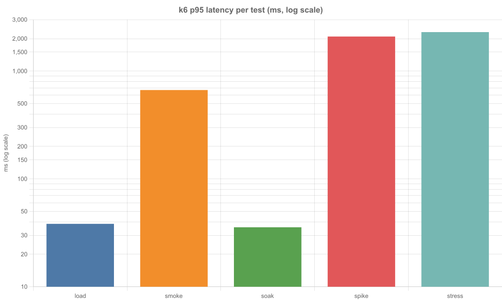
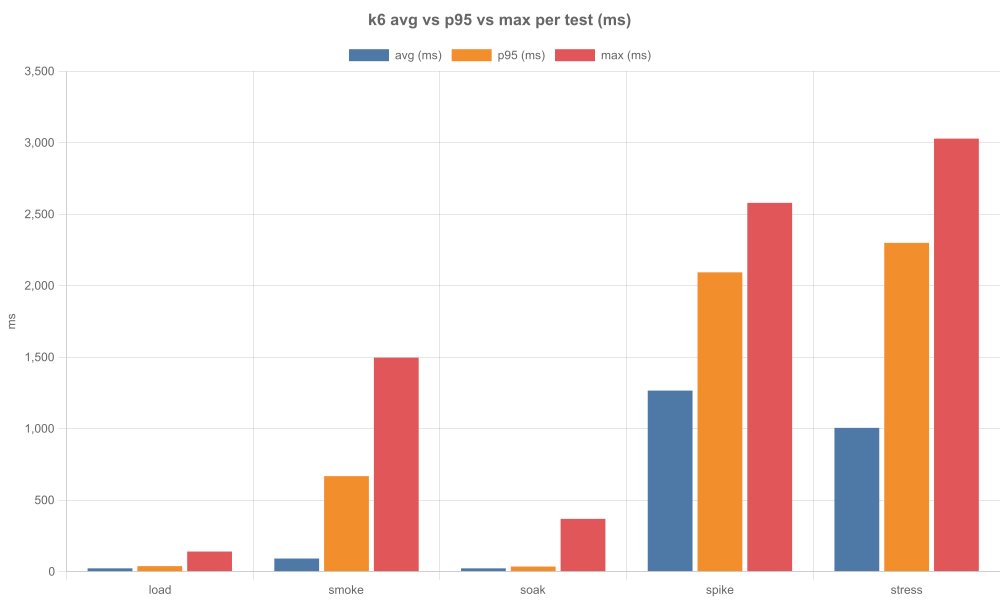

# บทที่ 4 การทดสอบสมรรถนะ (Performance Testing)

> หมายเหตุ: ตัวเลขทั้งหมดในบทนี้อ่านจากไฟล์ `k6/*-summary.json` ฉบับล่าสุดโดยตรง และสถานะ PASS/FAIL ประเมินตาม `options.thresholds` ที่ระบุไว้จริงในสคริปต์แต่ละไฟล์ (สรุปตรรกะไว้ใน `k6/report.mjs`)

## 1. บทนำ / วัตถุประสงค์ของการทดสอบ

การทดสอบสมรรถนะ (load testing) มีวัตถุประสงค์เพื่อพิสูจน์ว่าระบบ API ของเว็บแอปพลิเคชันแบ่งปันสูตรอาหาร Kinyark สามารถรองรับผู้ใช้งานพร้อมกันได้ตามที่ออกแบบไว้ โดยวัดจากเวลาตอบสนอง (response time) และอัตราความผิดพลาด (error rate) ภายใต้โหลดหลายรูปแบบ ตั้งแต่การใช้งานปกติไปจนถึงสภาวะโหลดกระชาก

เครื่องมือที่ใช้คือ k6 ซึ่งเป็นเครื่องมือทดสอบโหลดแบบโอเพนซอร์สที่กำหนดสถานการณ์ทดสอบด้วยโค้ด JavaScript และประเมินผลอัตโนมัติด้วยเกณฑ์ thresholds ที่ประกาศไว้ในสคริปต์แต่ละไฟล์ ผลการทดสอบในบทนี้ครอบคลุมการรัน 5 รูปแบบที่มีไฟล์สรุปผล (`*-summary.json`) ครบถ้วน

## 2. เครื่องมือและสภาพแวดล้อมการทดสอบ

- เครื่องมือ: k6 version v2.2.0 (Windows/amd64)
- ที่อยู่ระบบที่ทดสอบ (`BASE_URL`): `http://localhost:3000`
- สภาพแวดล้อม: localhost (เครื่องพัฒนาของผู้จัดทำ) ไม่ใช่ production ตามข้อกำหนดใน comment ของสคริปต์ที่ระบุให้รันเฉพาะ localhost/staging เท่านั้น
- วิธีรันเก็บผล (ตัวอย่าง):

```bash
k6 run k6/smoke.js -e BASE_URL=http://localhost:3000 --summary-export k6/smoke-summary.json
k6 run k6/load.js -e BASE_URL=http://localhost:3000 --summary-export k6/load-summary.json
node k6/report.mjs
```

ตารางที่ 1 สรุป endpoint ที่ใช้ทดสอบ (รวบรวมจากตัวแปร `TARGETS` ในสคริปต์จริง)

| ลำดับ | Endpoint | วิธีเรียก |
| :--- | :--- | :--- |
| 1 | `/api/health` | ตรวจสถานะระบบ |
| 2 | `/api/ingredients` | ดึงรายการวัตถุดิบ |
| 3 | `/api/search?q=ไข่` | ค้นหาด้วยคำค้นภาษาไทย |
| 4 | `/api/recipes?page=1&limit=12` | ดึงรายการสูตรอาหารแบบแบ่งหน้า |
| 5 | `/api/recipes/featured` | ดึงสูตรอาหารแนะนำ |

*ตารางที่ 1 รายการ endpoint ที่ใช้ในการทดสอบ*

ข้อสังเกต: `spike.js` และ `stress.js` ทดสอบเพียง 4 endpoint แรก (ไม่มี `featured`) ส่วน `breaking-point.js` ทดสอบเพียง `/api/health` endpoint เดียว

## 3. รูปแบบการทดสอบ (Test Scenarios)

ตารางที่ 2 สรุปสถานการณ์ทดสอบทั้ง 7 ไฟล์ โดยดึงค่า `options` (VUs/stages/duration/thresholds) จากโค้ดจริง ไม่ได้ประมาณขึ้น

| ชื่อเทสต์ | วัตถุประสงค์ | VUs / stages | ระยะเวลา | เกณฑ์ผ่าน (thresholds) |
| :--- | :--- | :--- | :--- | :--- |
| smoke | ตรวจสอบว่าทุก endpoint ทำงานถูกต้องขั้นพื้นฐาน | 1 VU คงที่ | 30 วินาที | `p(95)<800`, `failed<1%`, `checks>99%` |
| load | จำลองผู้ใช้งานปกติต่อเนื่อง | ramp `1m→20`, ค้าง `3m→20`, ลง `1m→0` | 5 นาที | `p(95)<800`, `p(99)<1500`, `failed<1%`, `checks>99%` |
| soak | จับปัญหา memory leak / เวลาตอบสนองไหลระยะยาว | 10 VUs คงที่ | 10 นาที | `p(95)<800`, `failed<1%`, `checks>99%` |
| spike | กระชากโหลดดูว่าระบบล้มแล้วฟื้นตัวหรือไม่ | `30s→0`, `30s→150`, `1m→150`, `1m→0` (สูงสุด 150 VUs) | 3 นาที | `failed<10%`, `checks>90%` |
| stress | ดันโหลดสูงต่อเนื่องหาแนวโน้มก่อนถึงจุดพัง | `2m→20`, `2m→80`, `2m→150`, `1m→150`, `1m→0` (สูงสุด 150 VUs) | 8 นาที | `failed<5%`, `checks>95%` |
| breaking-point | ดัน VUs ขึ้นเรื่อย ๆ จน error เกิน 30% แล้วหยุดเอง | ramping-vus 5 ช่วง × 2 นาที, `MAX_VUS` เริ่มต้น 300 | 10 นาที | `failed<30%` (`abortOnFail`) |
| warmup | อุ่น cache/connection pool ก่อนรันจริง (ไม่ใช่การทดสอบ) | 1 VU, 5 iterations | สั้นมาก | ไม่มี thresholds |

*ตารางที่ 2 สรุปสถานการณ์ทดสอบและเกณฑ์ผ่านจากโค้ดจริง*

เกณฑ์ของแต่ละเทสต์ต่างกันอย่างมีเหตุผล เทสต์กลุ่ม smoke/load/soak วัดประสบการณ์ผู้ใช้ปกติจึงคุมเวลาตอบสนองด้วย `p95<800ms` ส่วน spike/stress/breaking-point มีวัตถุประสงค์เพื่อดูพฤติกรรมของระบบภายใต้โหลดเกินปกติ จึงผ่อนเกณฑ์ด้าน latency ออกแล้ววัดเพียงว่า "ระบบยังไม่ล้ม" ผ่าน `http_req_failed` และ `checks` ที่ผ่อนตามความรุนแรงของเทสต์ (10%, 5%, 30% ตามลำดับ) ส่วน warmup ไม่ใช่การทดสอบจึงไม่มีเกณฑ์ใด ๆ

## 4. ผลการทดสอบ (Results)

### 4.1 ภาพรวม

ตารางที่ 3 สรุปตัวเลขหลักของทั้ง 5 เทสต์ที่มีไฟล์สรุปผล โดยสถานะ PASS/FAIL ประเมินตามเกณฑ์ของเทสต์นั้น ๆ (นิยามไว้ใน `k6/report.mjs` ซึ่งตรงกับ `options.thresholds` ของแต่ละไฟล์)

| เทสต์ | requests | avg | p95 | max | failed rate | checks rate | สถานะ |
| :--- | ---: | ---: | ---: | ---: | ---: | ---: | :--- |
| load | 2,389 | 22.98 ms | 38.32 ms | 140.58 ms | 0.00% | 100.00% | PASS |
| smoke | 65 | 91.30 ms | 667.71 ms | 1,496.93 ms | 0.00% | 100.00% | PASS |
| soak | 5,900 | 22.77 ms | 35.60 ms | 368.84 ms | 0.00% | 100.00% | PASS |
| spike | 8,996 | 1,265.80 ms | 2,093.31 ms | 2,579.25 ms | 0.00% | 100.00% | PASS |
| stress | 22,919 | 1,005.35 ms | 2,299.29 ms | 3,028.39 ms | 0.00% | 100.00% | PASS |

*ตารางที่ 3 ผลสรุปการทดสอบทั้ง 5 รูปแบบ*

### 4.2 ผลรายเทสต์และราย check per endpoint

ตารางราย check ดึงจาก `root_group.checks` ในไฟล์ summary ของแต่ละเทสต์โดยตรง

**load** — ผ่านทั้ง 3 เกณฑ์ (`p95 38.32ms < 800ms`, `failed 0.00% < 1%`, `checks 100.00% > 99%`)

| check | passes | fails | rate |
| :--- | ---: | ---: | ---: |
| health status 200 | 119 | 0 | 100.00% |
| health response time OK | 119 | 0 | 100.00% |
| ingredients status 200 | 474 | 0 | 100.00% |
| ingredients response time OK | 474 | 0 | 100.00% |
| search status 200 | 558 | 0 | 100.00% |
| search response time OK | 558 | 0 | 100.00% |
| recipes status 200 | 997 | 0 | 100.00% |
| recipes response time OK | 997 | 0 | 100.00% |
| featured status 200 | 236 | 0 | 100.00% |
| featured response time OK | 236 | 0 | 100.00% |

*ตารางที่ 4 ราย check ของการทดสอบ load (รวม 4,768 checks ผ่านทั้งหมด)*

**smoke** — ผ่านทั้ง 3 เกณฑ์ (`p95 667.71ms < 800ms`, `failed 0.00% < 1%`, `checks 100.00% > 99%`)

| check | passes | fails | rate |
| :--- | ---: | ---: | ---: |
| health status 200 / duration ok | 12 / 12 | 0 | 100.00% |
| ingredients status 200 / duration ok | 12 / 12 | 0 | 100.00% |
| search status 200 / duration ok | 12 / 12 | 0 | 100.00% |
| recipes status 200 / duration ok | 12 / 12 | 0 | 100.00% |
| featured status 200 / duration ok | 12 / 12 | 0 | 100.00% |

*ตารางที่ 5 ราย check ของการทดสอบ smoke (รวม 120 checks ผ่านทั้งหมด)*

**soak** — ผ่านทั้ง 3 เกณฑ์ (`p95 35.60ms < 800ms`, `failed 0.00% < 1%`, `checks 100.00% > 99%`) เวลาตอบสนองไม่ไหลขึ้นตลอด 10 นาที

| check | passes | fails | rate |
| :--- | ---: | ---: | ---: |
| health status 200 | 1,180 | 0 | 100.00% |
| ingredients status 200 | 1,180 | 0 | 100.00% |
| search status 200 | 1,180 | 0 | 100.00% |
| recipes status 200 | 1,180 | 0 | 100.00% |
| featured status 200 | 1,180 | 0 | 100.00% |

*ตารางที่ 6 ราย check ของการทดสอบ soak (รวม 5,900 checks ผ่านทั้งหมด)*

**spike** — ผ่านทั้ง 2 เกณฑ์ของเทสต์นี้ (`failed 0.00% < 10%`, `checks 100.00% > 90%`) แม้ `p95` จะสูงถึง 2,093.31ms ซึ่งไม่ใช่เกณฑ์ของเทสต์นี้

| check | passes | fails | rate |
| :--- | ---: | ---: | ---: |
| health status 200 | 2,368 | 0 | 100.00% |
| ingredients status 200 | 2,151 | 0 | 100.00% |
| search status 200 | 2,222 | 0 | 100.00% |
| recipes status 200 | 2,255 | 0 | 100.00% |

*ตารางที่ 7 ราย check ของการทดสอบ spike (รวม 8,996 checks ผ่านทั้งหมด)*

**stress** — ผ่านทั้ง 2 เกณฑ์ของเทสต์นี้ (`failed 0.00% < 5%`, `checks 100.00% > 95%`) โดย check ของเทสต์นี้ตรวจเพียงว่าไม่เกิด HTTP 5xx

| check | passes | fails | rate |
| :--- | ---: | ---: | ---: |
| health no 5xx | 5,683 | 0 | 100.00% |
| ingredients no 5xx | 5,769 | 0 | 100.00% |
| search no 5xx | 5,708 | 0 | 100.00% |
| recipes no 5xx | 5,759 | 0 | 100.00% |

*ตารางที่ 8 ราย check ของการทดสอบ stress (รวม 22,919 checks ผ่านทั้งหมด)*

### 4.3 กราฟเปรียบเทียบ



*ภาพที่ 1 กราฟเปรียบเทียบค่า p95 ของทุกเทสต์ (แกน y เป็นสเกล log เพราะค่าต่างกันมาก)*



*ภาพที่ 2 กราฟเปรียบเทียบค่า avg, p95 และ max แยกตามเทสต์ (หน่วยมิลลิวินาที)*

## 5. การวิเคราะห์ผล (Discussion)

ระบบตอบสนองเร็วมากในสภาวะโหลดปกติ โดย load (2,389 requests, 20 VUs) มี `p95` เพียง 38.32ms และ soak (5,900 requests, 10 VUs นาน 10 นาที) มี `p95` เพียง 35.60ms ซึ่งต่ำกว่าเกณฑ์ 800ms มาก และไม่มี error เลยแม้แต่ครั้งเดียว แสดงว่าระบบมีเสถียรภาพดีภายใต้โหลดที่คาดหวังจริง

จุดที่ latency พุ่งสูงในช่วง spike (`p95` 2,093.31ms) และ stress (`p95` 2,299.29ms, `max` 3,028.39ms) เป็นเรื่องปกติของเทสต์ประเภทนี้ ไม่ใช่ปัญหาของระบบ เนื่องจากเทสต์ทั้งสองจงใจไม่ตั้งเกณฑ์ `p95` ไว้แล้ววัดเพียงอัตราความล้มเหลว ผลคือแม้ถูกกระชากถึง 150 VUs ระบบก็ไม่เกิด error เลย (`failed 0.00%`, `checks 100.00%` ทั้ง 8,996 และ 22,919 requests) หมายความว่าระบบ "ช้าลงแต่ไม่ล้ม" และฟื้นตัวได้ตามวัตถุประสงค์ของ spike test

ข้อสังเกตเพิ่มเติมคือ smoke มี `max` สูงถึง 1,496.93ms ทั้งที่รันเพียง 1 VU แต่เนื่องจาก `p95` (667.71ms) ยังต่ำกว่าเกณฑ์ 800ms และ check ด้านเวลาผ่านทั้ง 120 checks จึงสรุปได้ว่าเป็น request ช้าเพียงครั้งคราว (เช่น cold start) ไม่ใช่ปัญหาต่อเนื่อง

สรุป ระบบผ่านเกณฑ์ที่ตั้งไว้ 5 จาก 5 การทดสอบที่มีผลรัน ส่วน breaking-point ยังไม่ได้รันจริง (ไม่มีไฟล์สรุปผล) และ warmup ไม่ใช่การทดสอบจึงไม่นับรวม

## 6. ข้อจำกัดของการทดสอบ

การทดสอบทั้งหมดรันบน localhost (เครื่องพัฒนาของผู้จัดทำ) ไม่ใช่ production จึงยังไม่สะท้อน latency ของเครือข่ายจริงและทรัพยากรของเซิร์ฟเวอร์จริง นอกจากนี้ soak test ในงานนี้ย่อระยะเวลาจากข้อกำหนดเดิม 30–60 นาทีเหลือเพียง 10 นาทีตาม comment ใน `k6/soak.js` จึงอาจจับ memory leak ที่เกิดช้ามาก ๆ ไม่ได้

ยังไม่ได้รัน breaking-point จริง (ไม่มี `breaking-point-summary.json` ในโฟลเดอร์ `k6/`) จึงยังไม่ทราบเพดาน VUs สูงสุดที่ระบบรับได้ และตาม comment ในสคริปต์ห้ามนำสคริปต์กลุ่มนี้ไปยิงเว็บจริง (production) เด็ดขาด สุดท้าย spike/stress ไม่ได้ครอบคลุม endpoint `featured` และ breaking-point ทดสอบเพียง `/api/health` จึงยังไม่ใช่ภาพครบทุก endpoint ภายใต้โหลดสูงสุด

## 7. สรุปและข้อเสนอแนะ

ผลการทดสอบสรุปได้ว่าระบบ Kinyark ผ่านการทดสอบสมรรถนะทั้ง 5 รูปแบบ โดยมีเวลาตอบสนองดีเยี่ยมในสภาวะปกติและไม่เกิดความผิดพลาดเลยแม้ภายใต้โหลดสูงสุด 150 VUs งานพัฒนาต่อควรเริ่มจากการรัน breaking-point บนสภาพแวดล้อมเสมือน production (staging) เพื่อหาเพดานผู้ใช้พร้อมกันสูงสุดที่แท้จริงก่อนเปิดใช้งานจริง

หากในอนาคตพบคอขวดด้าน latency ภายใต้โหลดสูง (เช่น `p95` เกิน 2 วินาทีแบบที่พบใน spike/stress) ข้อเสนอแนะคือเพิ่ม caching สำหรับ endpoint ที่เรียกบ่อย (`ingredients`, `recipes/featured`) ตรวจดัชนีฐานข้อมูลของ query ค้นหา (`/api/search`) และปรับ connection pooling ของ Prisma นอกจากนี้ควรรัน soak เต็ม 30–60 นาทีอีกครั้งบนสภาพแวดล้อม staging เพื่อยืนยันว่าไม่มี memory leak ระยะยาวก่อนส่งมอบงาน
